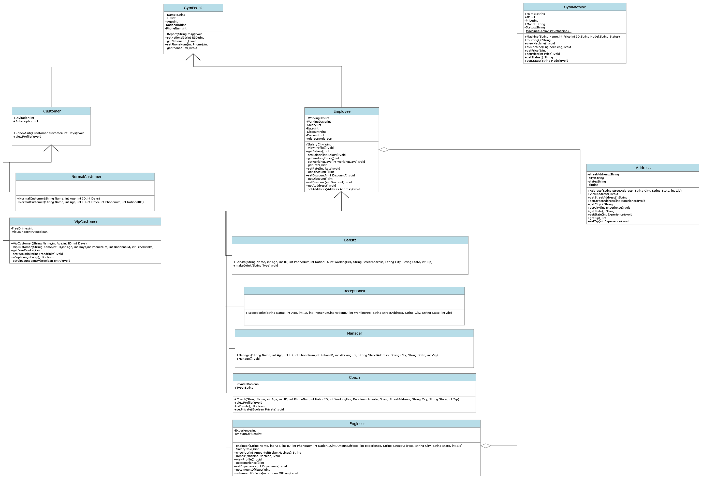

# Gym Managment System
A Gym Managment System built using Java with Basic OOP Concepts
> i.e. Inheritance, Aggregation, Association, Overloading, Overriding etc..

&nbsp;
&nbsp;

# Classes
```
1. GymPeople
   - Employee
     - Manager
     - Coach
     - Engineer
     - Barista
     - Receptionist
   - Customer
     - NormalCustomer
     - VipCustomer
2. GymMachine
```
&nbsp;
&nbsp;

# Usage
Track Customers / Employees by creating an object for each new Customer / Employee

# UML Class Diagram

